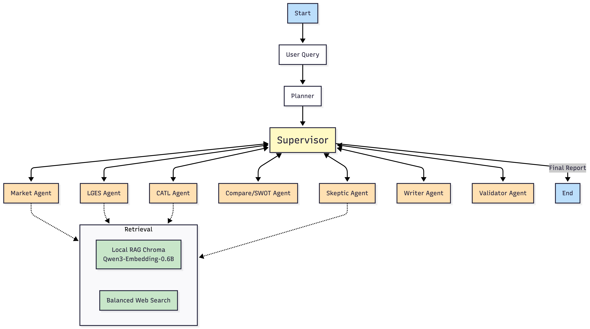
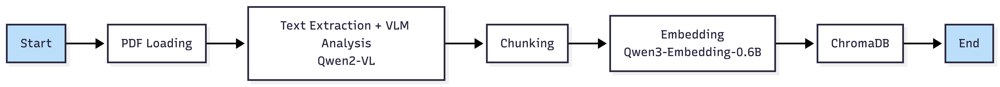

# Battery Strategy Agent

## Subject

배터리 산업 전략 비교 분석을 위한 멀티 에이전트 기반 리서치 시스템

## Overview

- Objective:
전기차 캐즘 환경에서 LG에너지솔루션과 CATL의 사업 포트폴리오 다각화 전략을 비교 분석하고, 시장 구조 변화와 리스크를 근거 기반으로 정리하는 초안 생성
- Method:
PDF 문서 기반 로컬 RAG와 웹 검색, 쿼리 재정의를 자율적으로 수행하는 Agent RAG 후, 멀티 에이전트가 시장 조사, 기업 분석, 반론 검증, 비교 분석, 보고서 작성을 분업 수행
- Tools:
Python 3.11, uv, OpenAI API, GitHub, Qwen Embedding, VL

## Features

- PDF 자료를 Pymupdf와 VLM으로 파싱하여 임베딩
- VLM사용으로 그래프, 도표, 이미지를 텍스트로 치환해 RAG 품질 향상
- 로컬 문서 검색, 웹 검색, 쿼리 재정의를 자율적으로 판단하는 Agentic RAG
- 시장, LGES, CATL 관점의 멀티 에이전트 분석
- 근거 수집 후 비교/요약/초안 자동 생성
- retrieval sufficiency 기반 fallback 및 재검토 분기
- 확증 편향 방지 전략:
긍정 근거와 리스크 근거를 분리 수집하고, Skeptic 단계에서 반대 근거와 누락 리스크를 재검증

## Tech Stack

| Category | Details |
| --- | --- |
| Framework | LangGraph, LangChain, Python |
| LLM | GPT-4o-mini, GPT-4o via OpenAI API |
| Retrieval | Chroma, Web Search |
| Embedding | Qwen3-Embedding-0.6B |
| Parsing | Pymupdf, Qwen2-VL-2B |

## Agents

- Planner Agent: 분석 목표를 바탕으로 섹션 구조와 조사 계획 수립
- Market Agent: 산업 구조, 수요 변화, 외부 리스크 조사
- LGES Agent: LG에너지솔루션 전략, 투자 포인트, 리스크 분석
- CATL Agent: CATL 전략, 확장 방향, 경쟁 우위 및 리스크 분석
- Skeptic Agent: 수집 근거의 편향, 누락, 반론 포인트 재검토
- Compare/SWOT Agent: 기업 간 전략 차이와 SWOT 정리
- Writer Agent: 최종 한국어 보고서 작성
- Validator Agent: 초안 품질과 구조 검증, 수정 루프 제어

## Architecture

### Main Architecture



### Preprocessing Architecure



## Directory Structure

```latex

├── .env.example            # 환경 변수 템플릿
├── agents/                 # Multi-agent 모듈
├── app.py                  # 실행 스크립트
├── assets/                 # README 이미지/샘플 PDF 등
├── config/                 # 설정값 및 상수
├── data/                   # PDF 문서, 메타데이터, 벡터 저장소
├── graph/                  # LangGraph 라우팅 및 빌더
├── ingestion/              # PDF 로딩, 청킹, 인제스트 파이프라인
├── outputs/                # 런타임 생성 결과물 (gitignore)
├── prompts/                # 프롬프트 템플릿
├── pyproject.toml          # 프로젝트 의존성/도구 설정
├── requirements.txt        # 의존성 목록
├── retrieval/              # 로컬 RAG, 웹 검색, 검색 정책
├── schemas/                # 상태/데이터 스키마
├── tests/                  # 단위 테스트
├── utils/                  # 공통 유틸
├── uv.lock                # uv lock 파일
└── README.md
```

## Use

### 1. 의존성 설치

```bash
uv sync
```

### 2. 프로젝트 실행

```bash
uv run app.py
```

### 2-1. 그래프 시각화

```python
from graph.builder import build_graph
from langchain_teddynote.graphs import visualize_graph

graph = build_graph()
visualize_graph(graph)
```

프로젝트 헬퍼를 쓰고 싶다면 아래도 같은 동작입니다.

```python
from graph.visualization import display_graph

display_graph(graph)
```

### 3. 결과물 확인

- HTML: `outputs/{thread_id}_{YYYYMMDD_HHMMSS}.html`
- PDF: `outputs/{thread_id}_{YYYYMMDD_HHMMSS}.pdf`

## Lessons Learned

### 김경록

1. 각 에이전트가 독립적으로 잘 동작하는 것도 중요하지만, Supervisor가 명확한 에이전트 흐름을 만드는 것이 높은 품질의 데이터를 만들고, 오류 발생 시 해결하는데 용이하다는 것을 알 수 있었다. 그러나 Supervisor가 각 에이전트를 관리하는 과정에서 LLM 요청이나 외부 검색이 실패할 때, 적절하게 예외 처리를 하지 않는다면 무한 루프에 빠지거나 예상과 다른 결과물을 만드는 것을 보며, 적절한 fallback plan과 조기 종료 조건을 설계하는 것이 중요하다고 생각했다.
2. Local RAG를 먼저 수행하고 부족할 때만 웹 검색으로 확장하는 방식이 API 호출 비용 및 LLM 토큰 비용을 줄이고 속도 측면에서도 효율적이라고 느꼈다. 또한 이 프로젝트에서는 Google News를 이용한 뉴스 자료 위주의 웹 검색 로직을 구현했는데, 한 주제에 대해 여러 개의 유사한 기사가 검색되는 경우가 많었다. 이에 웹 검색에 의존하기보다 균형 잡힌 로컬 RAG 데이터베이스를 구축하는 것이 균형있는 결과물을 만드는 데에 더 적합하다고 생각했다.
3. 회사 우위 비교 에이전트와 보고서 작성 에이전트를 구현하면서, LLM이 왜 이러한 응답을 생성했는지 확인해야 하는 경우가 많았다. 이를 추적하기 위해 콘솔에 명료한 로그를 남기는 것이 중요했으며, 특히 LangSmith와 같은 로깅 도구를 연동하여 Input / Ouput을 확인하는 것이 큰 도움이 되었다.

### 장효빈

1. 이전 실습에서는 초기 프로젝트 뼈대를 세우지 않고 각자 개발을 진행하여 통합하는 데 많은 비용이 있었습니다. 이번에는 스켈레톤 코드를 만들고 진행하여 통합이 매우 수월했습니다.
2. vector store에 저장할 때, 어떤 형식으로 metadata를 정해야 할 지 고민했습니다. 이전 실습에서의 경험을 바탕으로 reference에 필요한 것, 중복 저장을 방지하기 위한 것, 검색 시 필터링을 위한 것들을 선정해서 저장했습니다. 또한 이 형식을 공통 폴더에서 공유해 일관성 있게 개발할 수 있도록 했습니다.
3. 리포트나 IR 자료에는 그래프나 도표 자료가 많기 때문에 단순 Text 파싱으로는 고품질의 데이터를 만들 수 없었습니다. 이에 오픈소스 VLM 모델을 활용하여 비 텍스트 요소들을 텍스트로 설명하게 하고, 이를 페이지별로 청크에 합쳤습니다. 그 결과 도표의 수치적인 부분이 RAG에 저장되었고, 보고서에서 수치적인 부분을 나타낼 수 있었습니다.
4. 처음부터 파싱을 VLM을 사용하여 end-to-end로 사용하는 것도 괜찮다는 생각이 들었습니다. 물론 실시간 처리에는 문제가 있을 수도 있지만 RAG를 위한 데이터를 만드는 데에는 실시간성이 크게 중요하지 않기 때문에 다음부터는 고려해 보려고 합니다.

## Contributors

- 김경록: Agent Design, Prompt Engineering
- 장효빈: Preprocessing for RAG, Vector Store 구성

## 최종보고서 샘플

[최종보고서 샘플](./assets/final-report.pdf)
